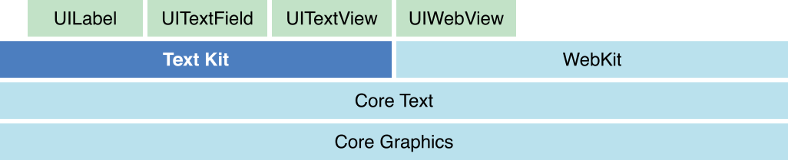
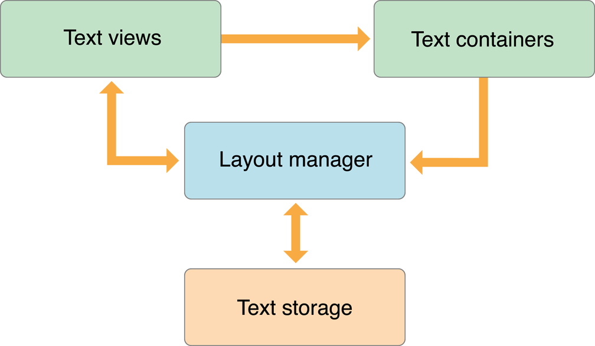

# 使用 TextKit 製作橫向滾動 Reader
## Outline
- Demo 預覽
- TextKit 簡單介紹
- 準備
- ReaderView
- repeat-loop with UITextView
- 優化一些樣式

- - - -

今天想教大家使用 TextKit 製作一款橫向閱讀的 Reader。

## Demo 預覽


## 什麼是 TextKit
TextKit 是一個管理文字儲存，以及執行以文字為基礎內容的自定義佈局的強大工具。這其中有四大類需要認識和掌握，分別是 NSTextStorage，NSLayoutManager ，NSTextContainer 以及平台對應的 TextView。

TextKit 框架的位置：



## NSTextStorage
NSTextStorage 是 NSMutableAttributedString 的子類，這意味著你可以如同使用 NSAttributedString 一樣，增添和修改其中的樣式。同時，它也承擔著管理一系列 NSLayoutManager 的責任。

你可以通過  `addLayoutManager(_:)`，`removeLayoutManager(_:)` 來管理其持有的 NSLayoutManager。

最後要說明的是，NSTextStorage 可以被任何線程訪問，意味著你可以將相關的文字樣式處理放入背景或其他非主線程中。需要注意的是你必須確保每次只有一個線程正在訪問 NSTextStorage 對象。

## NSLayoutManager
NSLayoutManager 對象是一個協調文字佈局以及呈現被 NSTextStorage 持有的字元（character）的物件。在其內部，是將 unicode character 映射（map）成字形（glyph），並設置給其持有的一系列 NSTextContainer 對象，最後再將他們呈現在相關的 TextView 上（在 MacOS 上為 NSTextView，在 iOS 上為 UITextView）。

你可以通過 `addTextContainer(_:)`，`insertTextContainer(_:at:)`，`removeTextContainer(at:)` 等方法來管理其持有的 NSTextStorage 對象。

## NSTextContainer
NSTextContainer 會在被初始化時決定其大小（size），而這片區域（region）就是 text 如何被 layout 的地方。於是，NSLayoutManager 依據這片區域的大小，決定什麼時候需要換行（break lines），或佈局部分的 text。

基本上，NSTextContainer 所指定的區域是一個矩形，不過你也可以通過添加 `exclusionPaths `  來告訴 NSTextContainer 需要避開那些位置。

## TextView
TextKit 中的 TextView，需要依據不同平台，來初始化不同的 view 來使用。在 MacOS 中，我們需要使用 NSTextView 來供 TextKit 呈現內容；而在 iOS 中使用 UITextView。

## 四者關係
在 Text Programming Guide 中有一張非常出名的圖用來表示四者關係：



在 code 中的呈現基本如下：
```swift
import UIKit

let textStorage = NSTextStorage(attributedString: attributedString)

let textLayout = NSLayoutManager()
textStorage.addLayoutManager(textLayout)

let textContainer = NSTextContainer(size: CGSize(width: 500, height: 500))
textLayout.addTextContainer(textContainer)

let textView = UITextView(
  frame: .init(x: 0, y: 0, width: 500, height: 500),
  textContainer: textContainer
)

PlaygroundPage.current.liveView = textView
```

## Getting Started
在 Xcode 中新建一個專案，選擇 **Single View App**，命名為 **Reader**，Language 設定為 **Swift**，我們就可以開始了。

由於我們不使用 Storyboard，也請麻煩刪除掉 **Main.storyboard** 以及對應的 storyboard 初始化資料。另外也刪除掉 **ViewController.swift**，在做任何開發時，我們還是希望擁有一個好的命名習慣。

你的 Xcode Project 看起來基本上會像這樣：


右擊在 **AppDelegate.swift** 上，選擇 New File 並選擇 **Swift File**，命名為 **ReaderViewController**，並替換掉裡面的全部內容為以下 code：
```swift
import UIKit

final class ReaderViewController: UIViewController {
  
  override func viewDidLoad() {
    super.viewDidLoad()
    
    view.backgroundColor = .white
    navigationItem.title = "Reader"
  }
  
}
```

也替換掉 AppDelegate.swift 全部內容為下 code：
```swift
import UIKit

@UIApplicationMain
class AppDelegate: UIResponder, UIApplicationDelegate {

  var window: UIWindow?

  func application(
    _ application: UIApplication,
    didFinishLaunchingWithOptions launchOptions: [UIApplication.LaunchOptionsKey: Any]?)
    -> Bool
  {
    let readerViewControlelr = ReaderViewController()
    let navigationController = UINavigationController(rootViewController: readerViewControlelr)
    window = UIWindow(frame: UIScreen.main.bounds)
    window?.rootViewController = navigationController
    window?.makeKeyAndVisible()
    return true
  }

}
```

## Import Large Text
這裡我準備了一些[長文字內容](https://raw.githubusercontent.com/Arcovv/TextKit-Tutorial/master/Reader/Diamond%20Sutra.txt)，拖進專案後，在 **ReaderViewController** 增加如下方法：
```swift
private func fullContent() -> String {
    let url = Bundle.main.url(forResource: "Diamond Sutra", withExtension: "txt")!
    return try! String(contentsOf: url, encoding: .utf8)
}
```

你可以在 **viewDidLoad()** 中測試 `print(fullContent().count)` 是否會在 console 中印出對應數字，來檢測該函數是否正常運作。

> PS: 如果你遇到 App 運行崩潰的情況，請前往 Project Navigator - Targets - Reader - Build Phases - Copy BundleResources 中檢查拖拽進來的檔案是否也呈現在其中，如果沒有就按下方的加號添加進去。  


## Setup Reader
在 **ReaderViewController** 中增加 `let contentView = UIScrollView()` ，這個 view 將被我們用來放置文字滾動的部分，同時追加 setupContentView() 的方法，用來設定我們的 contentView：
```swift
private func setupContentView() {
    contentView.backgroundColor = .orange
    contentView.translatesAutoresizingMaskIntoConstraints = false
    view.addSubview(contentView)
    
    NSLayoutConstraint.activate([
      contentView.topAnchor.constraint(equalTo: view.safeAreaLayoutGuide.topAnchor),
      contentView.leadingAnchor.constraint(equalTo: view.safeAreaLayoutGuide.leadingAnchor),
      contentView.bottomAnchor.constraint(equalTo: view.safeAreaLayoutGuide.bottomAnchor),
      contentView.trailingAnchor.constraint(equalTo: view.safeAreaLayoutGuide.trailingAnchor)
    ])
}
```

運行完你應該會看到一個 orange 顏色的畫面：


> 記得將 setupContentView 在 viewDidLoad() 時執行。  

隨後，追加 `setupReader()` 方法，開始建構我們的閱讀器吧：
```swift
private func setupReader() {
    // 1
    let attributedString = NSAttributedString(
      string: fullContent(), attributes: [:]
    )

    // 2
    let textStorage = NSTextStorage(attributedString: attributedString)

    // 3
    let textLayout = NSLayoutManager()
    textStorage.addLayoutManager(textLayout)
    
    // 4
    let textContainer = NSTextContainer(size: contentView.bounds.size)
    textLayout.addTextContainer(textContainer)

    // code here
}
```

1. 第一步是建構一個 NSAttributedString，便於 NSTextStorage 初始化。因為我們已經寫好了 **fullContent()** 函數，可以直接調用並取得到我們想要填入的文字。attributes 是文字樣式的部分，這裡我們先不處理
2. 建構我們的 NSTextStorage
3. 建構我們的 NSLayoutManager，並把它加到 textStorage 中

然後開始處理我們的 TextView 部分，在 code here 中繼續寫入：
```swift
let viewSize = contentView.bounds.size
let textInsets = UIEdgeInsets(top: 16, left: 16, bottom: 16, right: 16)

// 1
var index: Int = 0
var glyphRange: Int = 0
var numberOfGlyphs: Int = 0

repeat {
  // 2
  let textContainer = NSTextContainer(size: viewSize)
  textLayout.addTextContainer(textContainer)

  // 3
  let textViewFrame = CGRect(
    x: CGFloat(index) * viewSize.width,
    y: 0,
    width: viewSize.width,
    height: viewSize.height
  )

  // 4
  let textView = UITextView(
    frame: textViewFrame,
    textContainer: textContainer
  )

  // 5
  textView.isEditable = false
  textView.isSelectable = false
  textView.textContainerInset = textInsets
  textView.showsVerticalScrollIndicator = false
  textView.showsHorizontalScrollIndicator = false
  textView.isScrollEnabled = false
  textView.bounces = false
  textView.bouncesZoom = false

  // 6
  textViews.append(textView)
  contentView.addSubview(textView)

  // 7
  index += 1
  glyphRange = NSMaxRange(textLayout.glyphRange(for: textContainer))
  numberOfGlyphs = textLayout.numberOfGlyphs
} while glyphRange < numberOfGlyphs - 1 // 8
```

這塊內容不少，但我們依舊可以慢慢來解釋：
1. 在我們的 Demo 預覽中，閱讀器是可以橫向不斷滾動下去的，而每一個我們所見的 text 區域，其實就是由每一個 UITextView 所組成並呈現的，因此我們需要 repeat - while loop 來協助我們處理這件事情，而 index / glyphRange / numberOfGlyghs 會幫助我們處理 loop 的條件
2. 建構我們的 NSTextContainer，並把它加到 textLayout 中
3. 計算每一個 TextView 的座標
4. 構造 UITextView，在這裡傳入我們的 textContainer
5. 對 textView 做一點樣式上的調整，使其在滾動過程看起來更舒服
6. 把每一個 textView 加入到我們的 textViews 中，就可以依據 count 計算出一共有多少頁了；並再把它們加入成 content view 的 subview
7. 通過 glyphRange 可以知道目前字形 glyph 到哪一個點，再與 numberOfGlyphs 比較，就可以判斷中斷條件了
8. 計算 repeat - while 何時中斷

將 **setupReader()** 放在 **viewDidLoad** 中運行：


欸？為什麼還是什麼文字都沒有？這裡我們還少做了兩件事情：
- 計算完並放把每一個 textView 放入 content view 後，我們需要告訴 content view 你的 content size 是多少
- 我們的 view size 是通過 content view 得出的，那麼我們把這段代碼運行在 view did load 之中，size 是多少呢？當然是 (0, 0) 了

所以，我們先需要在 repeat - while loop 之後，加上這段代碼：
```swift
repeat {
    ...
} while while glyphRange < numberOfGlyphs - 1 // 8

contentView.contentSize = CGSize(
  width: viewSize.width * CGFloat(textViews.count),
  height: viewSize.height
)
```

然後把我們的 **setupReader()** 從 **viewDidLoad()** 中拿出，重新在 **ReaderViewController** 中加入這段代碼：
```swift
override func viewDidLayoutSubviews() {
  super.viewDidLayoutSubviews()
  setupReader()
}
```

**viewDidLayoutSubviews()** 是告訴我們 view 已經把我們底下的 subviews 們都佈局好了，這樣我們就可以取得到正確的 view size 了。


## Update Style
現在我們還有幾個問題需要彌補：
- 背景顏色是綠色太醜了
- content view 的顏色也不好看
- 左右滾動的時候沒有 page 的阻尼效果
- 左右滾動底下還是有滾動條，不好看
- 字體太小了
- 問題太過緊湊了

先把我們的 textView 和 contentView 的 **backgroundColor** 改成 white；
```swift
textView.backgroundColor = .white
contentView.backgroundColor = .white
```

再到 **setupContentView** 中，增加一些東西：
```swift
contentView.showsVerticalScrollIndicator = false
contentView.showsHorizontalScrollIndicator = false
contentView.isPagingEnabled = true
```

前面兩條是告訴我們的 content view 隱藏掉水平和垂直的滾動條；最後一條是告訴 content view 使用 paging 的方式來滾動。

還記得我們在初始化 attributedString 時沒有添加文字樣式嗎？
```swift
let attributedString = NSAttributedString(
    string: fullContent(), attributes: [:]
)
```

將這段 code 修改如下：
```swift
let paragraphStyle = NSMutableParagraphStyle()
paragraphStyle.lineHeightMultiple = 1.2

let attributedString = NSAttributedString(
  string: fullContent(),
  attributes: [
    .font: UIFont.preferredFont(forTextStyle: .body),
    .paragraphStyle: paragraphStyle
  ]
)
```

現在再運行一下，是不是舒服多啦？


以上就是這篇教程的全部內容了，全部代碼我會放在 [Arcovv/TextKit-Tutorial · GitHub](https://github.com/Arcovv/TextKit-Tutorial)，歡迎提問與指點！
